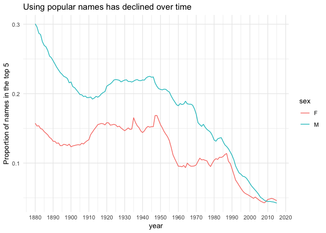

First, check out some examples [here](https://github.com/thomasp85/gganimate) and [here](https://github.com/thomasp85/gganimate/wiki)
[here](https://github.com/ropenscilabs/learngganimate) (we'll come back to this)

Now, let's try one of the plots he created. Notice that it takes awhile to run. Then it displays it over in the viewer, rather than beneath the code, like we're used to. 


```r
ggplot(mtcars, aes(factor(cyl), mpg)) + 
  geom_boxplot() + 
  # Here comes the gganimate code
  transition_states(
    gear,
    transition_length = 2,
    state_length = 1
  ) +
  enter_fade() + 
  exit_shrink() +
  ease_aes('sine-in-out')
```

We can save this as a gif. You need to PUT IN A PATH!!! (Go to where you want to save it, right click (or Control+click), hold down the option key, choose Copy "folder" as pathname ... wow, that's trickier than it should be). Then, be sure to name your gif as well. And ... BE CAREFUL WITH EXTRA SPACES that may be added when you copy and paste. I spent 20 minutes trying to figure out that problem (insert huge eye roll and palm to forehead). In order to open it from that your folder, you need to right click and open with a browser.


```r
anim_save("PUT YOUR PATH HERE/boxplots.gif")
```


Now, I can load that gif back in. This is a nice thing to do when you knit your file. Otherwise it will take forever to run!


##Babynames example

We'll start with a simple example. Here is a static graph of the proportion of baby names in the top 5 over time.


```r
prop_top_5 <- 
  babynames %>% 
  group_by(year, sex) %>% 
  top_n(n = 5, wt = n) %>% 
  summarize(prop_in_top5 = sum(prop))

prop_top_5 %>% 
  ggplot() +
  geom_line(aes(x=year, y=prop_in_top5, color=sex)) +
  labs(title = "Using popular names has declined over time",
       y = "Proportion of names in the top 5") +
  scale_x_continuous(breaks = seq(1880,2020,10)) +
  theme_minimal()
```

<!-- -->


The code below shows two ways we could animate this. The second one is not very valuable but helps show a different version of how to animate.


```r
prop_top_5_anim_yr <- 
 prop_top_5 %>% 
 ggplot() +
  geom_line(aes(x=year, y=prop_in_top5, color=sex)) +
  labs(title = "Using popular names has declined over time",
       y = "Proportion of names in the top 5") +
  scale_x_continuous(breaks = seq(1880,2020,10)) +
  theme_minimal() +
  transition_reveal(year)

prop_top_5_anim_yr %>% 
  animate()
```


```r
prop_top_5_anim_sex <-
  prop_top_5 %>% 
  ggplot() +
  geom_line(aes(x=year, y=prop_in_top5, color=sex)) +
  labs(title = "Using popular names has declined over time",
       y = "Proportion of names in the top 5") +
  scale_x_continuous(breaks = seq(1880,2020,10)) +
  theme_minimal() +
  transition_manual(sex)

prop_top_5_anim_sex %>% 
  animate()
```


There are many different types of transitions and ways to bring in transitions. 


```exercise
Map my bike ride using animation! Requirements:
1. Show current location with a red point. 
2. Path up until the current point should be shown as well.
3. Color the line according to elevation.
4. Add something of your own!
```


```r
mallorca_bike_day7 <- read_csv("https://www.dropbox.com/s/zc6jan4ltmjtvy0/mallorca_bike_day7.csv?dl=1") %>% 
  select(1:4, speed)
```


```r
mallorca_map <- get_stamenmap(
    bbox = c(left = 2.38, bottom = 39.55, right = 2.62, top = 39.7), 
    maptype = "terrain",
    zoom = 11
)
```


```exercise
Use animation to tell an interesting story with the `small_trains` dataset that contains data from the SNCF (National Society of French Railways). Read more about the data [here](https://github.com/rfordatascience/tidytuesday/tree/master/data/2019/2019-02-26).
```


```r
small_trains <- read_csv("https://raw.githubusercontent.com/rfordatascience/tidytuesday/master/data/2019/2019-02-26/small_trains.csv") 
```
