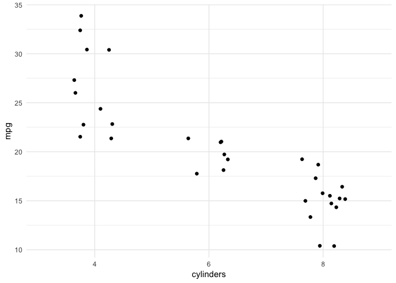

```r
library(tidyverse)
library(babynames)
library(knitr)
library(ggmap)
library(gganimate)
```


#Resources 

* [gganimate by Thomas Pedersen](https://github.com/thomasp85/gganimate) - scroll down to the bottom 
* [Pedersen introductory vignette](https://cran.r-project.org/web/packages/gganimate/vignettes/gganimate.html) - gives a brief intro to what each of the key functions do
* [gganimate wiki page](https://github.com/thomasp85/gganimate/wiki) - most of this is currently under development but there's some good examples

* [ropensci examples](https://github.com/ropenscilabs/learngganimate).


#Key elements

The `gganimate` package works well with `ggplot2` functions by providing additional grammar that assists in adding animation to the plots. From Thomas Pedersen's documentation, here are the key functions/grammar of the package:

* `transition_*()` defines how the data should be spread out and how it relates to itself across time (time is not always actual time).
* `view_*()` defines how the positional scales should change along the animation.
* `shadow_*()` defines how data from other points in time should be presented in the given point in time.
* `enter_*()/exit_*()` defines how new data should appear and how old data should disappear during the course of the animation.
* `ease_aes()` defines how different aesthetics should be eased during transitions.

#Examples

##`mtcars` examples

Let's look at a simple, static plot that shows the distribution of *mpg* by *cylinder*.


```r
ggplot(mtcars, aes(factor(cyl), mpg)) + 
  geom_jitter(width = .2) +
  theme_minimal() +
  xlab("cylinders")
```

<!-- -->

Now, let's try adding some animation. Notice that it takes a second to run. As your animations get more complicated, these take longer to load. When finished, it is displayed over in the viewer, rather than beneath the code, like we're used to. 


```r
ggplot(mtcars, aes(factor(cyl), mpg)) + 
  geom_jitter(width = .2) +
  theme_minimal() +
  xlab("cylinders") +
  # Here comes the gganimate code
  transition_manual(gear) +
  ggtitle('Gear:{current_frame}')
```

We also could have saved this code and then used the `animate()` function.


```r
mtcars_anim_by_gear <-
  ggplot(mtcars, aes(factor(cyl), mpg)) + 
  geom_jitter(width = .2) +
  theme_minimal() +
  xlab("cylinders") +
  # Here comes the gganimate code
  transition_manual(gear) +
  ggtitle('Gear:{current_frame}')

animate(mtcars_anim_by_gear)
```

We can save this as a gif. You need to PUT IN A PATH!!! (Go to where you want to save it, right click (or Control+click), hold down the option key, choose Copy "folder" as pathname ... wow, that's trickier than it should be). Then, be sure to name your gif as well. And ... BE CAREFUL WITH EXTRA SPACES that may be added when you copy and paste. I spent 20 minutes trying to figure out that problem (insert huge eye roll and palm to forehead).


```r
anim_save("YOUR PATH/mtcars_scatter_gear.gif")
```


If you want to open the gif you just created, you need to right click and choose open with a browser. 

Now, I can load that gif back in (you'll need to modify this code to point to the path you used). This is a nice thing to do when you knit your file. Otherwise it will take forever to run, especially as you add more complicated animations that have many more frames!


```r
include_graphics("YOUR PATH/mtcars_scatter_gear.gif")
```


The `transition_manual()` is the most basic and doesn't allow for any tweening, which is animation as your transitioning from state to state. So, let's try a transition that allows that. We also add some `enter_*()` and `exit_*()` options. Notice this takes longer to run, as it's making many more frames than the previous animation.


```r
ggplot(mtcars, aes(factor(cyl), mpg, group=gear)) + 
  geom_jitter(width = .2) +
  theme_minimal() +
  xlab("cylinders") +
  # Here comes the gganimate code
  transition_states(gear)  +
  enter_fade() + 
  exit_shrink() 
```
**Caution**: the group aesthetic here is important. Try taking it out. Notice that the points look like they are moving across gears. This can be a good thing, but in this case wouldn't make sense.


##`babynames` examples

The next example will illustrate some new transitions, `transition_reveal()` and `transition_time()`. We will also see some additional options for how to display past (and future) points. First, here is a static graph of the proportion of baby names in the top 5 over time.


```r
prop_top_5 <- 
  babynames %>% 
  group_by(year, sex) %>% 
  top_n(n = 5, wt = n) %>% 
  summarize(prop_in_top5 = sum(prop))

prop_top_5_line <-
  prop_top_5 %>% 
  ggplot() +
  geom_line(aes(x=year, y=prop_in_top5, color=sex)) +
  labs(title = "Using popular names has declined over time",
       y = "Proportion of names in the top 5") +
  scale_x_continuous(breaks = seq(1880,2020,10)) +
  theme_minimal()

prop_top_5_line
```

<!-- -->


Here are some animations using this dataset, trying to highlight some options that are available.

`transition_reveal()` keeps the history and is useful for showing a line or path over time or spatially, like on a map.


```r
prop_top_5_line +
  transition_reveal(year) 
```

The `shadow_wake()` function allows you to see some of the historical data. There are options to modify how exactly you see them.


```r
prop_top_5_points <- 
 prop_top_5 %>% 
 ggplot() +
  geom_point(aes(x=year, y=prop_in_top5, color=sex)) +
  labs(title = "Using popular names has declined over time",
       y = "Proportion of names in the top 5") +
  scale_x_continuous(breaks = seq(1880,2020,10)) +
  theme_minimal() 


prop_top_5_points +
  transition_time(year) +
  shadow_wake(wake_length = .1, size = .7, alpha = .7) 
```

`shadow_trail()` shows a fraction of the historical points, like a breadcrumb trail.


```r
prop_top_5_points +
  transition_time(year) +
  shadow_trail()
```

#Your turn!


```exercise
Map my bike ride using animation! Requirements:
1. Show current location with a red point. 
2. Path up until the current point should be shown as well.
3. Color the line according to elevation.
4. Add something of your own!
```


```r
mallorca_bike_day7 <- read_csv("https://www.dropbox.com/s/zc6jan4ltmjtvy0/mallorca_bike_day7.csv?dl=1") %>% 
  select(1:4, speed)
```


```r
mallorca_map <- get_stamenmap(
    bbox = c(left = 2.38, bottom = 39.55, right = 2.62, top = 39.7), 
    maptype = "terrain",
    zoom = 11
)

ggmap(mallorca_map)
```

<!-- -->

The map below shows something similar, but for 7 different bike rides.


```r

```


```exercise
Use animation to tell an interesting story with the `small_trains` dataset that contains data from the SNCF (National Society of French Railways). Read more about the data [here](https://github.com/rfordatascience/tidytuesday/tree/master/data/2019/2019-02-26).
```


```r
small_trains <- read_csv("https://raw.githubusercontent.com/rfordatascience/tidytuesday/master/data/2019/2019-02-26/small_trains.csv") 
```
